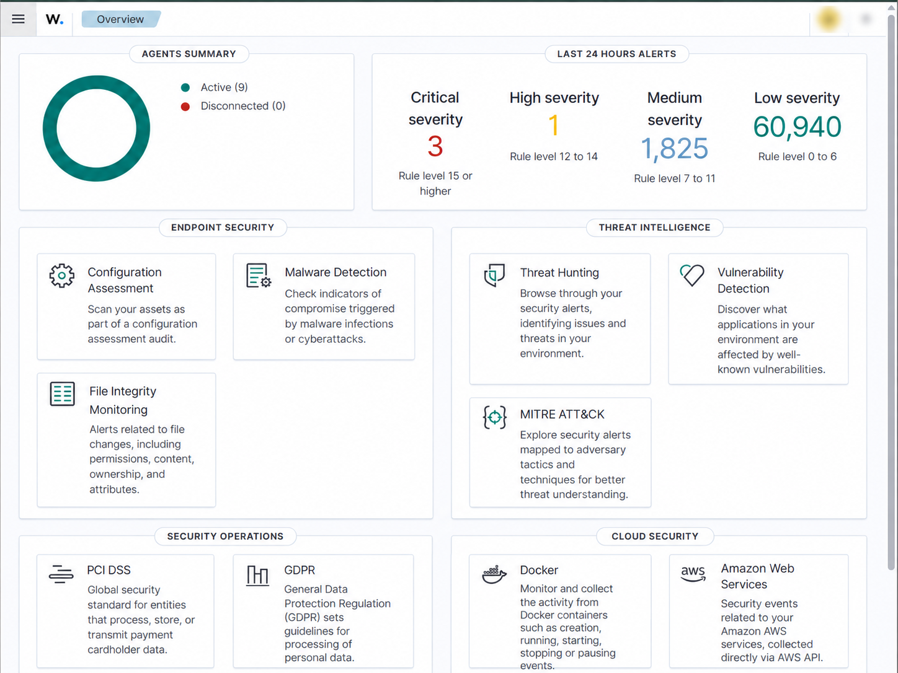
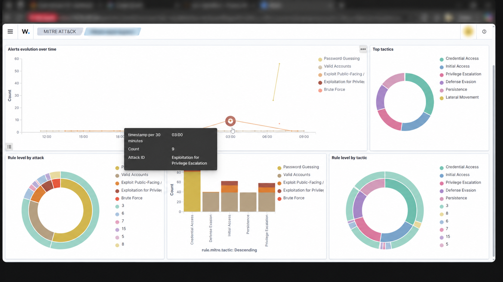
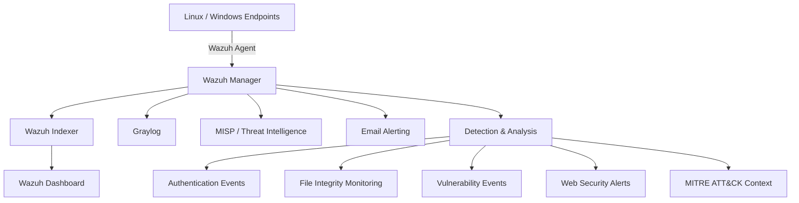

# Wazuh SIEM Security Monitoring

A sanitized engineering case study based on my internship work implementing and evaluating a centralized security-monitoring environment using **Wazuh**, with supporting **Graylog**, **MISP**, and email-alerting workflows.

> **Portfolio scope:** this repository intentionally excludes credentials, private infrastructure details, raw production logs, internal hostnames, private IP addresses, and other organization-specific identifiers. Configuration snippets use placeholders or generic values.

## Highlights

- Centralized endpoint and server security monitoring with Wazuh.
- File Integrity Monitoring (FIM), vulnerability visibility, authentication analysis, and alert review.
- Graylog integration for additional log exploration and visualization.
- MISP-based threat-intelligence workflow.
- Email alerting and MITRE ATT&CK-oriented analysis.
- A documented monitoring window containing **663,762 security alerts**.
- Public evidence is intentionally limited to a small set of sanitized screenshots rather than raw infrastructure captures.

## Visual Evidence

### Wazuh Overview Dashboard



Point-in-time view of the monitoring environment showing active agents, alert severity distribution, and the available endpoint-security and threat-intelligence modules.

### MITRE ATT&CK Dashboard



ATT&CK-oriented analysis of Wazuh rule matches through views such as alert evolution, top tactics, rule level by attack, and rule level by tactic. These mappings provide investigation context and are **not** automatic proof of successful compromise.

More detail: [`EVIDENCE.md`](EVIDENCE.md) and [`docs/mitre-attack.md`](docs/mitre-attack.md).

## Project Summary

The project focused on improving visibility into endpoint and server security events through centralized collection, detection, analysis, and reporting.

Core capabilities documented in the final implementation include:

- Wazuh-based SIEM monitoring,
- endpoint agent enrollment and centralized event collection,
- File Integrity Monitoring,
- vulnerability detection,
- security log analysis and alert review,
- Graylog integration,
- MISP threat-intelligence workflow,
- email alert notification,
- MITRE ATT&CK mapping for selected security activity,
- security and compliance-oriented reporting.

## Architecture

The diagram below is a sanitized logical view rather than the original network topology.



See [`architecture/architecture.md`](architecture/architecture.md) for the design rationale and data flow.

## What I Worked On

- Configured and operated a Wazuh-based centralized monitoring environment.
- Enrolled endpoints and validated event delivery to the manager.
- Configured File Integrity Monitoring for monitored system and application paths.
- Enabled vulnerability detection using endpoint inventory data.
- Reviewed authentication, file-integrity, malware/rootcheck, and web-related security alerts.
- Integrated Wazuh-generated data with Graylog for additional log management and visualization.
- Used MISP as part of the threat-intelligence workflow.
- Configured email-based alert notification.
- Mapped selected alert categories to MITRE ATT&CK tactics and techniques.
- Reviewed Wazuh-generated compliance mappings including PCI DSS, GDPR, HIPAA, TSC, and NIST 800-53.

## Monitoring Snapshot

One documented monitoring window contained:

| Metric | Observed value |
|---|---:|
| Total security alerts | **663,762** |
| Authentication successes | **37,433** |
| Authentication failures | **2,852** |
| Alerts at level 12 or above | **6** |

Examples of rule-triggered activity included authentication failures, CMS login/brute-force indicators, web-server error patterns, SQL-injection attempt alerts, Shellshock-related alerts, file/registry integrity changes, rootcheck/possible-rootkit alerts, and Wazuh agent connectivity or queue events.

**Interpretation note:** these values describe SIEM rule matches and monitoring observations. A triggered rule is not automatically a confirmed incident.

## Additional Point-in-Time Evidence

The internship material also contains snapshots showing:

- **9 active agents** in one Wazuh Overview view,
- a 24-hour severity view containing **3 critical**, **1 high**, **1,825 medium**, and **60,940 low-severity** alerts,
- a populated Vulnerability Detection view containing **3 critical**, **13 high**, **16 medium**, **2 low**, and **45 pending-evaluation** findings,
- Wazuh Maps configured from `wazuh-alerts-*` using `GeoLocation.location`,
- ATT&CK-oriented views containing tactics such as Credential Access, Initial Access, Privilege Escalation, Defense Evasion, Persistence, and Lateral Movement.

These are point-in-time views rather than permanent project totals.

## Core Documentation

| Area | Documentation |
|---|---|
| Implementation | [Implementation Overview](docs/implementation-overview.md) |
| Architecture | [SIEM Architecture](architecture/architecture.md) |
| File integrity | [File Integrity Monitoring](docs/file-integrity-monitoring.md) |
| Vulnerability visibility | [Vulnerability Detection](docs/vulnerability-detection.md) |
| ATT&CK analysis | [MITRE ATT&CK Mapping](docs/mitre-attack.md) |
| Log management | [Graylog Integration](docs/graylog-integration.md) |
| Threat intelligence | [MISP Integration](docs/misp-integration.md) |
| Monitoring findings | [Monitoring & Security Analysis](docs/monitoring-analysis.md) |

## Additional Security Labs

The working notes covered additional integrations and experiments. They are kept separate so the repository does not imply that every explored item was part of the final deployed monitoring stack.

- [Suricata IDS/IPS Integration](labs/suricata-integration.md)
- [Security Configuration Assessment](labs/security-configuration-assessment.md)
- [ClamAV Integration](labs/clamav-integration.md)
- [Docker Monitoring](labs/docker-monitoring.md)
- [GeoIP Enrichment](labs/geoip-enrichment.md)
- [Active Response](labs/active-response.md)
- [VirusTotal Integration](labs/virustotal-integration.md)
- [Index Lifecycle Management](labs/index-lifecycle-management.md)

See [`labs/README.md`](labs/README.md) for the evidence classification used in this repository.

## Sanitized Configuration Examples

Example snippets are available under [`configs/wazuh/`](configs/wazuh/):

- `fim-example.xml`
- `vulnerability-detection.xml`
- `alerting-example.xml`

They are illustrative portfolio examples, not drop-in production configurations.

## Repository Structure

```text
.
├── .gitignore
├── README.md
├── EVIDENCE.md
├── PORTFOLIO.md
├── DISCLAIMER.md
├── SECURITY.md
├── architecture/
│   └── architecture.md
├── docs/
│   ├── implementation-overview.md
│   ├── file-integrity-monitoring.md
│   ├── vulnerability-detection.md
│   ├── mitre-attack.md
│   ├── graylog-integration.md
│   ├── misp-integration.md
│   └── monitoring-analysis.md
├── labs/
│   ├── README.md
│   ├── suricata-integration.md
│   ├── security-configuration-assessment.md
│   ├── clamav-integration.md
│   ├── docker-monitoring.md
│   ├── geoip-enrichment.md
│   ├── active-response.md
│   ├── virustotal-integration.md
│   └── index-lifecycle-management.md
├── configs/wazuh/
│   ├── fim-example.xml
│   ├── vulnerability-detection.xml
│   └── alerting-example.xml
├── screenshots/
│   ├── README.md
│   ├── wazuh-overview-dashboard-sanitized.png
│   └── wazuh-mitre-attack-dashboard-sanitized.png
└── reports/
    └── README.md
```

## Evidence, Security, and Portfolio Use

- [`EVIDENCE.md`](EVIDENCE.md) — explains what the public screenshots demonstrate and how evidence is sanitized.
- [`screenshots/README.md`](screenshots/README.md) — documents the two published visual artifacts.
- [`reports/README.md`](reports/README.md) — explains why raw monitoring reports are not public.
- [`SECURITY.md`](SECURITY.md) — repository security and sanitization guidance.
- [`.gitignore`](.gitignore) — blocks common secret files, raw logs/reports, key material, and local artifacts from accidental commits.
- [`DISCLAIMER.md`](DISCLAIMER.md) — scope and reuse limitations.
- [`PORTFOLIO.md`](PORTFOLIO.md) — concise project copy for a CV, website, LinkedIn, or application form.

## Portfolio Description

> Implemented a centralized security-monitoring environment using Wazuh with Graylog and MISP integrations. Configured file-integrity monitoring, vulnerability detection, log analysis, and alerting, and analyzed more than 663K security events while mapping selected activities to MITRE ATT&CK.
