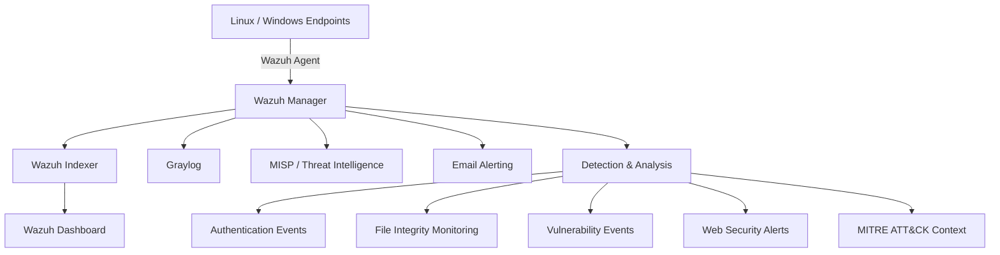

# Wazuh SIEM Security Monitoring

A sanitized engineering case study based on my internship work implementing and evaluating a centralized security monitoring environment using **Wazuh**, with supporting integrations for **Graylog**, **MISP**, and email alerting.

> This repository intentionally excludes credentials, private infrastructure details, internal hostnames, internal IP addresses, and other sensitive organizational information. Example configurations use placeholders and generic identifiers.

## Project Summary

The project focused on improving visibility into endpoint and server security events through centralized collection, detection, analysis, and reporting.

Core capabilities documented in the final implementation include:

- Wazuh-based SIEM monitoring
- Endpoint agent enrollment and centralized event collection
- File Integrity Monitoring (FIM)
- Vulnerability detection
- Security log analysis and alert review
- Graylog integration for centralized log visualization and analysis
- MISP integration for threat-intelligence workflows
- Email alert notification
- MITRE ATT&CK mapping for selected security activities
- Security and compliance-oriented reporting

## Architecture



See [`architecture/architecture.md`](architecture/architecture.md) for the design rationale and data flow.

## What I Worked On

- Configured and operated a Wazuh-based centralized monitoring environment.
- Enrolled endpoints and validated event delivery to the manager.
- Configured File Integrity Monitoring to detect changes to monitored system and application files.
- Enabled vulnerability detection using endpoint inventory data.
- Reviewed authentication, file integrity, malware/rootkit, and web-related security alerts.
- Integrated Wazuh-generated data with Graylog for additional log management and visualization.
- Used MISP as part of the threat-intelligence workflow.
- Configured email-based alert notifications.
- Mapped selected alert categories to MITRE ATT&CK tactics/techniques.
- Reviewed Wazuh-generated compliance-oriented reports including PCI DSS, GDPR, HIPAA, TSC, and NIST 800-53 mappings.

## Monitoring Snapshot

One documented monitoring window contained:

| Metric | Observed value |
|---|---:|
| Total security alerts | 663,762 |
| Authentication successes | 37,433 |
| Authentication failures | 2,852 |
| Alerts at level 12 or above | 6 |

Examples of rule-triggered activity included:

- multiple authentication failures,
- CMS login attempts and brute-force indicators,
- web server error patterns,
- SQL injection attempt alerts,
- Shellshock-related alerts,
- file and registry integrity changes,
- rootcheck / possible rootkit alerts,
- Wazuh agent queue and connectivity events.

**Important:** these are SIEM rule matches and monitoring observations, not automatically confirmed security incidents. Alert context must be investigated before classifying an event as malicious.

## Additional Point-in-Time Dashboard Evidence

Reviewed screenshots from the internship material also show:

- **9 active agents** in one Wazuh Overview snapshot,
- a 24-hour severity view containing **3 critical**, **1 high**, **1,825 medium**, and **60,940 low-severity** alerts,
- a populated Vulnerability Detection view with **3 critical**, **13 high**, **16 medium**, **2 low**, and **45 pending-evaluation** findings,
- Wazuh Maps configured from `wazuh-alerts-*` using `GeoLocation.location`,
- MITRE ATT&CK-oriented views covering tactics such as Credential Access, Initial Access, Privilege Escalation, Defense Evasion, Persistence, and Lateral Movement.

These are point-in-time views and should not be interpreted as permanent project totals or proof of confirmed compromise.

## Core Documentation

- [Implementation Overview](docs/implementation-overview.md)
- [Architecture](architecture/architecture.md)
- [File Integrity Monitoring](docs/file-integrity-monitoring.md)
- [Vulnerability Detection](docs/vulnerability-detection.md)
- [MITRE ATT&CK Mapping](docs/mitre-attack.md)
- [Graylog Integration](docs/graylog-integration.md)
- [MISP Integration](docs/misp-integration.md)
- [Monitoring & Security Analysis](docs/monitoring-analysis.md)

## Additional Security Labs

The internship working notes covered additional integrations and experiments. These are intentionally separated from the final implementation evidence.

- [Suricata IDS/IPS Integration](labs/suricata-integration.md)
- [Security Configuration Assessment](labs/security-configuration-assessment.md)
- [ClamAV Integration](labs/clamav-integration.md)
- [Docker Monitoring](labs/docker-monitoring.md)
- [GeoIP Enrichment](labs/geoip-enrichment.md)
- [Active Response](labs/active-response.md)
- [VirusTotal Integration](labs/virustotal-integration.md)
- [Index Lifecycle Management](labs/index-lifecycle-management.md)

See the [Additional Security Labs index](labs/README.md) for the evidence classification used in this repository.

## Evidence & Portfolio Use

- [`EVIDENCE.md`](EVIDENCE.md) — reviewed screenshots, suggested captions, evidence selection, and redaction checklist.
- [`screenshots/`](screenshots/README.md) — planned structure for sanitized visual evidence.
- [`PORTFOLIO.md`](PORTFOLIO.md) — project descriptions ready to adapt for a CV, personal website, LinkedIn, or application form.

## Repository Structure

```text
.
├── README.md
├── EVIDENCE.md
├── PORTFOLIO.md
├── DISCLAIMER.md
├── SECURITY.md
├── architecture/
│   └── architecture.md
├── docs/
│   ├── implementation-overview.md
│   ├── file-integrity-monitoring.md
│   ├── vulnerability-detection.md
│   ├── mitre-attack.md
│   ├── graylog-integration.md
│   ├── misp-integration.md
│   └── monitoring-analysis.md
├── labs/
│   ├── README.md
│   ├── suricata-integration.md
│   ├── security-configuration-assessment.md
│   ├── clamav-integration.md
│   ├── docker-monitoring.md
│   ├── geoip-enrichment.md
│   ├── active-response.md
│   ├── virustotal-integration.md
│   └── index-lifecycle-management.md
├── configs/
│   └── wazuh/
│       ├── fim-example.xml
│       ├── vulnerability-detection.xml
│       └── alerting-example.xml
├── screenshots/
│   └── README.md
└── reports/
    └── README.md
```

## Security & Privacy

This repository is a **sanitized portfolio reconstruction**. It does not publish raw production logs, credentials, organization-specific endpoint names, private infrastructure addresses, or confidential operational details.

Read [`SECURITY.md`](SECURITY.md), [`DISCLAIMER.md`](DISCLAIMER.md), and [`EVIDENCE.md`](EVIDENCE.md) before reusing configurations or adding screenshots.

## Portfolio Description

> Implemented a centralized security monitoring environment using Wazuh with Graylog and MISP integrations. Configured file integrity monitoring, vulnerability detection, log analysis, and alerting, and analyzed more than 663K security events while mapping selected activities to MITRE ATT&CK.
