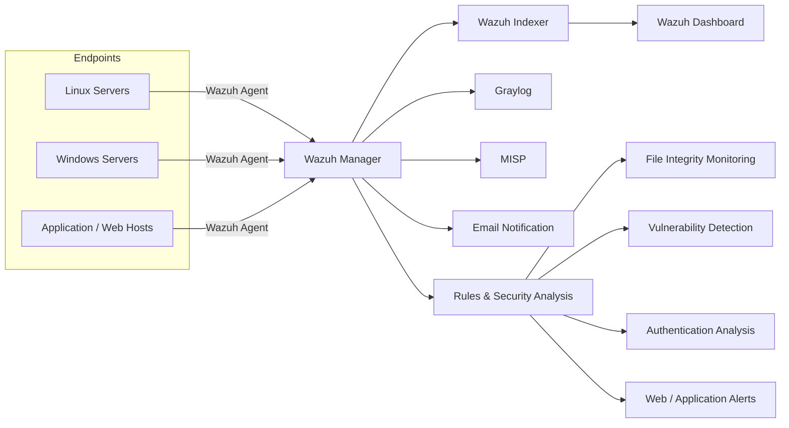

# SIEM Architecture

## Goal

The monitoring environment was designed to centralize endpoint security events, analyze security-relevant activity, and provide administrators with a single place to review alerts and supporting context.

## High-level design

## Data flow

1. Wazuh agents collect endpoint security and system events.
2. Events are forwarded to the Wazuh Manager.
3. The manager evaluates events using the Wazuh ruleset and produces alerts where rules match.
4. Alert and monitoring data is indexed for search and visualization in the Wazuh Dashboard.
5. Selected log data can be forwarded to Graylog for centralized log exploration and custom visualization.
6. MISP supports threat-intelligence context and indicator handling.
7. Email notification provides an additional alert-delivery channel for configured severity thresholds.

## Design rationale

### Centralized monitoring

A centralized SIEM reduces the need to inspect each host independently and makes it easier to correlate activity across multiple endpoints.

### Endpoint visibility

Wazuh agents provide endpoint-oriented visibility including authentication activity, file integrity changes, system inventory, and security rule matches.

### Separate log analytics

Graylog was used as a complementary log-management layer. This separates security detection from broader log exploration and visualization workflows.

### Threat intelligence

MISP adds a workflow for handling threat intelligence and indicators of compromise rather than treating every alert as isolated endpoint telemetry.

## Portfolio scope

This diagram is intentionally generic. Original endpoint names, addresses, and infrastructure-specific identifiers are not published.
