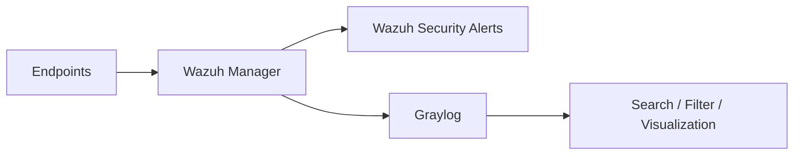

# Graylog Integration

## Purpose

Graylog was used as a complementary log-management layer for collecting, searching, filtering, and visualizing log data associated with the monitoring environment.

## Role in the architecture

Wazuh remains responsible for endpoint-oriented security monitoring and rule-based alert generation. Graylog provides a separate workspace for broader log exploration and visualization.

## Documented integration

The internship report describes Wazuh log output being sent to Graylog using GELF (Graylog Extended Log Format). Once ingested, administrators can use Graylog dashboards to monitor and analyze log activity.

## Why use both?

The combination provides two different operational views:

| Wazuh | Graylog |
|---|---|
| security rules and endpoint monitoring | centralized log exploration |
| FIM, rootcheck, vulnerability events | flexible search and filtering |
| Wazuh-native dashboards | custom log visualization |
| security-oriented alerting | broader log-management workflows |

## Portfolio note

Exact production addresses, credentials, input configuration, and organization-specific log routing are intentionally excluded from this public repository.
