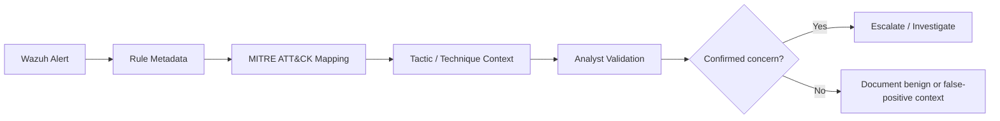

# MITRE ATT&CK Mapping

## Objective

Use Wazuh's MITRE ATT&CK views to organize security alerts into adversary tactics and techniques so monitoring data can be interpreted in a more structured way than raw rule IDs alone.

## ATT&CK in this project

The internship documentation describes ATT&CK as a framework that organizes adversary behavior into:

- **Tactics** — the strategic objective an adversary is trying to achieve.
- **Techniques** — the method used to achieve that objective.
- **Sub-techniques** — a more specific variation of a technique.

The documented Wazuh views were used to review rule matches through this ATT&CK context.

## Published Visual Evidence

> **MITRE ATT&CK dashboard.** Wazuh rule matches reviewed through ATT&CK-oriented views such as top tactics, alert evolution, and rule-level distributions. The mappings provide investigation context and do not by themselves confirm compromise.

The public screenshot is sanitized to remove environment-specific browser/asset identifiers while preserving the dashboard content and chart values.

## Observed Dashboard Categories

The published evidence shows ATT&CK-oriented views containing tactics such as:

- Credential Access,
- Initial Access,
- Privilege Escalation,
- Defense Evasion,
- Persistence,
- Lateral Movement.

The internship working notes also discuss Discovery, Reconnaissance, and Impact in the ATT&CK analysis context.

> These labels represent ATT&CK mappings associated with Wazuh rules and observed alerts. They are **not automatic proof that an attacker successfully completed those actions**.

## Dashboard Views

The documented MITRE ATT&CK dashboard includes:

- alert evolution over time,
- top tactics,
- rule level by attack,
- rule level by tactic.

This helps move from a raw-alert question — *"which rule fired?"* — toward an analyst question — *"what behavior or attack objective is this rule intended to represent?"*

## Example Interpretation Workflow

## Why the Mapping Is Useful

ATT&CK context can support:

- alert triage,
- communicating findings consistently,
- grouping related detections,
- prioritizing suspicious behaviors,
- identifying gaps in monitoring coverage,
- documenting why a rule deserves additional investigation.

## Example: Defense Evasion

The working notes describe Defense Evasion as behavior intended to avoid or bypass security monitoring. Examples discussed in the notes include:

- obfuscation or file encoding,
- disabling security tools,
- timestomping,
- rootkit-related activity,
- credential-access activity performed in a stealthy manner.

These are investigation themes. The presence of a mapped alert still requires validation against the actual event, host context, user activity, and surrounding telemetry.

## Analyst Caution

ATT&CK is most useful when combined with event context. A mapped rule should be treated as a detection signal requiring investigation rather than a definitive statement that a complete attacker tactic occurred.

For the overall evidence policy, see [`../EVIDENCE.md`](../EVIDENCE.md).