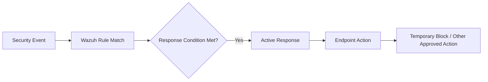

# Wazuh Active Response Lab

> **Classification:** Internship lab / implementation notes.

## Objective

Explore Wazuh Active Response as a mechanism for automatically executing a predefined response action when an alert meets configured conditions.

The internship notes describe a flow where the Wazuh Manager detects an event, matches it against a rule, and triggers a response command on an endpoint.



## Global Active Response Setting

Example from the working notes:

```xml
<active-response>
  <disabled>no</disabled>
  <ca_store>/var/ossec/etc/wpk_root.pem</ca_store>
</active-response>
```

## Command Example

The notes use Wazuh's `firewall-drop` response as an example:

```xml
<command>
  <name>firewall-drop</name>
  <executable>firewall-drop.sh</executable>
  <expect>srcip</expect>
  <timeout_allowed>yes</timeout_allowed>
</command>
```

A corresponding response rule example:

```xml
<active-response>
  <command>firewall-drop</command>
  <location>local</location>
  <level>8</level>
  <timeout>600</timeout>
</active-response>
```

In the internship notes:

- `location=local` means the action runs on the endpoint receiving the event.
- `level=8` limits the action to alerts meeting that severity threshold.
- `timeout=600` represents a temporary response duration of 10 minutes.

## Validation Approach

This feature should only be validated in a controlled and authorized environment.

A safe validation process is:

1. Verify the response command is present and executable.
2. Generate an approved test event that matches the configured rule/threshold.
3. Confirm the response is executed on the expected endpoint.
4. Confirm the action is automatically reversed after the timeout where applicable.
5. Review Wazuh logs to confirm why the response was triggered.

## Security Value

Active Response demonstrates how SIEM detection can be connected to automated containment, reducing the time between detection and mitigation for carefully selected use cases.

## Operational Risks

Automation must be used conservatively. False positives can cause legitimate users or services to be blocked.

Before production use, response logic should include:

- clear trigger conditions,
- allow-list / exclusion handling where appropriate,
- timeout and recovery behavior,
- logging and auditability,
- testing for false positives,
- rollback procedures.

## Portfolio Interpretation

This page documents an explored response mechanism from the internship working notes. It should not be interpreted as evidence that automatic blocking was enabled across the final production environment.
