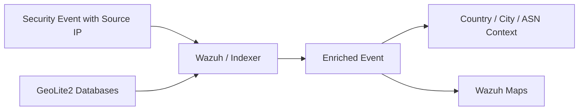
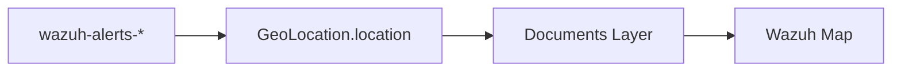

# GeoIP Enrichment Lab

> **Classification:** Internship lab / implementation notes.

## Objective

Enrich security events with geographic context using MaxMind GeoLite2 data so source IP addresses can be associated with country/city/ASN information during investigation.

## Concept



The internship notes used MaxMind GeoLite2 databases and the Wazuh Indexer GeoIP ingest module.

## GeoLite2 Update Setup

Example installation flow:

```bash
sudo apt update
sudo apt install geoipupdate -y
```

A sanitized `/etc/GeoIP.conf` example:

```text
AccountID <MAXMIND_ACCOUNT_ID>
LicenseKey <MAXMIND_LICENSE_KEY>
EditionIDs GeoLite2-City GeoLite2-Country GeoLite2-ASN
```

Update and verify the local databases:

```bash
sudo geoipupdate -v
ls -l /usr/share/GeoIP/
```

Expected database families include City, Country, and ASN data.

## Indexer Integration Notes

The working notes copied GeoLite2 databases to the Wazuh Indexer ingest-geoip module directory and adjusted ownership before restarting the indexer.

Sanitized example:

```bash
sudo mkdir -p /usr/share/wazuh-indexer/modules/ingest-geoip/
sudo cp -r /usr/share/GeoIP/* /usr/share/wazuh-indexer/modules/ingest-geoip/
sudo chown -R wazuh-indexer:wazuh-indexer /usr/share/wazuh-indexer/modules/ingest-geoip/Geo*
sudo systemctl restart wazuh-indexer
```

## Wazuh Maps Validation

The reviewed visual evidence shows a Documents layer configured with:

```text
Index pattern: wazuh-alerts-*
Geospatial field: GeoLocation.location
```

A separate screenshot shows an enriched event plotted in the East Java area. This demonstrates that geographic fields were available to Wazuh Maps and could be used for visualization.



## Validation Approach

1. Confirm GeoLite2 databases are present.
2. Confirm the indexer starts successfully after the database update.
3. Verify the GeoIP ingest module is available.
4. Inspect events containing public source IP addresses.
5. Confirm geographic fields are populated where data is available.
6. Create a Wazuh Maps layer from `wazuh-alerts-*` using `GeoLocation.location`.
7. Confirm enriched documents can be rendered as map points.

## Suggested Portfolio Evidence

Recommended paths once sanitized screenshots are added:

```text
screenshots/geoip/map-sanitized.png
screenshots/geoip/layer-configuration-sanitized.png
```

Suggested caption:

> **GeoIP-enriched event visualization.** Security alert data was plotted using the `GeoLocation.location` field to add geographic context during investigation.

## Security Value

GeoIP context can help analysts:

- quickly understand the geographic origin associated with public IP telemetry,
- group or filter alerts by region,
- add context to authentication or web-security investigations,
- identify unusual geographic patterns for further review.

## Interpretation Warning

Geolocation is **context, not proof of attacker identity or physical location**. VPNs, proxies, cloud providers, carrier networks, NAT, and database accuracy can all affect results.

## Privacy & Repository Safety

Do not publish real MaxMind credentials or raw internal event data. Portfolio examples should use placeholders and, where screenshots are added, redact internal addresses and organizational identifiers.
