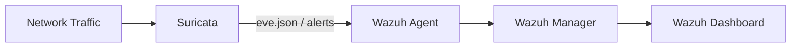

# Suricata IDS/IPS Integration Lab

> **Classification:** Internship lab / integration notes. This page is not presented as evidence that Suricata was part of the final production monitoring stack.

## Objective

Extend endpoint-focused Wazuh monitoring with network-based detection by forwarding Suricata events into Wazuh.

The working notes describe Suricata as an additional **IDS/IPS** layer capable of inspecting network traffic that is allowed through normal firewall rules, including traffic on services such as HTTP/HTTPS.

## Why this matters

A firewall primarily controls whether traffic is allowed or blocked. Suricata adds traffic inspection and signature-based detection, while Wazuh centralizes the resulting security events with endpoint telemetry.

A simplified data flow is:



## Example Suricata Configuration

The original notes used a local `HOME_NET` and an AF_PACKET interface. Public portfolio examples should always replace environment-specific values:

```yaml
vars:
  address-groups:
    HOME_NET: "[<INTERNAL_SUBNET>]"

af-packet:
  - interface: <NETWORK_INTERFACE>
    cluster-id: 99
```

Rules can then be updated and Suricata restarted:

```bash
sudo suricata-update
sudo systemctl restart suricata
sudo systemctl status suricata
```

## Event Outputs

The notes distinguish two Suricata outputs:

- `fast.log` — compact line-based alert output.
- `eve.json` — structured JSON events suitable for integration with third-party tools.

A JSON alert stream can be inspected with:

```bash
sudo tail -f /var/log/suricata/eve.json \
  | jq 'select(.event_type == "alert")'
```

## Wazuh Collection Example

A sanitized Wazuh local-file configuration can ingest Suricata JSON events:

```xml
<localfile>
  <log_format>json</log_format>
  <location>/var/log/suricata/eve.json</location>
</localfile>
```

After configuration changes, restart the Wazuh agent and verify that Suricata events appear in the monitoring pipeline.

## Validation Approach

The internship notes used a benign NIDS test utility to generate traffic that should trigger IDS signatures. For a public portfolio, validation should be performed only in an authorized lab environment.

Expected validation sequence:

1. Confirm Suricata is running.
2. Generate known test traffic in an isolated/authorized environment.
3. Confirm an alert appears in `eve.json`.
4. Confirm the Wazuh agent forwards the event.
5. Confirm the event is searchable in the Wazuh dashboard.

## Security Value

This integration demonstrates a defense-in-depth concept: endpoint security telemetry from Wazuh can be complemented by network-level detection from Suricata.

## Limitations

- Requires correct placement of the Suricata sensor to observe relevant traffic.
- Deep packet inspection adds CPU/RAM overhead.
- Detection quality depends on rule quality and maintenance.
- An existing dedicated IDS/IPS may make a second Suricata sensor redundant.
- Signature matches still require analyst validation and should not automatically be treated as confirmed incidents.
