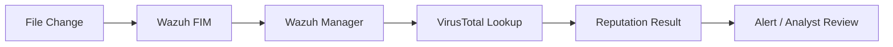

# VirusTotal Integration Lab

> **Classification:** Internship lab / implementation notes.

## Objective

Explore VirusTotal integration with Wazuh so file-integrity events can be enriched with external file-reputation information.

The internship notes describe a concept combining:

- File Integrity Monitoring (FIM),
- VirusTotal reputation checks,
- and optional Active Response logic for malicious-file handling.



## Wazuh Integration Example

A sanitized configuration based on the internship notes:

```xml
<integration>
  <name>virustotal</name>
  <api_key><VIRUSTOTAL_API_KEY></api_key>
  <group>syscheck</group>
  <alert_format>json</alert_format>
</integration>
```

Never commit a real API key to GitHub.

## Validation Approach

A safe validation process is:

1. Enable FIM for a controlled test directory.
2. Confirm file changes generate `syscheck` events.
3. Configure VirusTotal using a non-public secret management method.
4. Use a benign/approved test artifact.
5. Verify that the integration produces a reputation-related event.
6. Review the result in Wazuh before considering any automated response.

## Security Value

This integration can add external reputation context to file events, helping an analyst prioritize investigation when an unknown or changed file is observed.

## Important Limitations

- Reputation services are supporting evidence, not an absolute verdict.
- API quotas and usage restrictions may apply.
- Files or hashes sent to external services can have privacy implications depending on integration behavior and organizational policy.
- Automated deletion/quarantine should not be enabled solely on the basis of a single reputation signal without appropriate validation.

## Portfolio Interpretation

The final internship report does not establish VirusTotal as part of the final deployed production stack. It is therefore documented here as an explored integration rather than a production claim.
