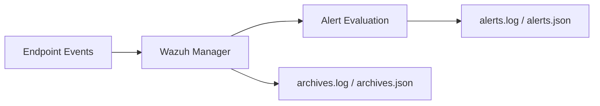

# Wazuh Archives Lab

> **Classification:** Internship lab / implementation notes.

## Objective

Store all events received by the Wazuh Manager, including events that do not meet the normal alert threshold, so raw telemetry can be retained for deeper investigation or troubleshooting.

## Concept

Wazuh alerts represent events that meet rule/threshold conditions. Archives can retain a broader event stream.



The working notes identify these archive paths:

```text
/var/ossec/logs/archives/archives.log
/var/ossec/logs/archives/archives.json
```

## Manager-Side Example

```xml
<ossec_config>
  <global>
    <jsonout_output>yes</jsonout_output>
    <alerts_log>yes</alerts_log>
    <logall>yes</logall>
    <logall_json>yes</logall_json>
  </global>
</ossec_config>
```

A sanitized example is available in [`../configs/wazuh/archives-example.xml`](../configs/wazuh/archives-example.xml).

## Filebeat Integration Note

The internship notes also enabled the Wazuh Filebeat archive stream so archived events could be forwarded for indexing:

```yaml
filebeat.modules:
  - module: wazuh
    alerts:
      enabled: true
    archives:
      enabled: true
```

This example is intentionally minimal and should be validated against the installed Wazuh/Filebeat version before reuse.

## Validation Approach

1. Enable archive output on the manager.
2. Restart or reload the required services.
3. Generate normal endpoint activity that may not trigger a high-level alert.
4. Confirm archive files are being populated.
5. If forwarding archives, confirm the archive stream is indexed and searchable.

## Operational Trade-Offs

The working notes explicitly call out why archives are not enabled by default in every environment:

- significantly higher storage usage,
- more events to process and index,
- additional manager/indexer load,
- increased retention and privacy considerations.

Archive retention should therefore be designed around investigation needs, storage capacity, and data-governance requirements.

## Portfolio Scope

This is documented as a lab/working-note capability rather than a claim that full raw-event archiving was permanently enabled in the final production monitoring stack.